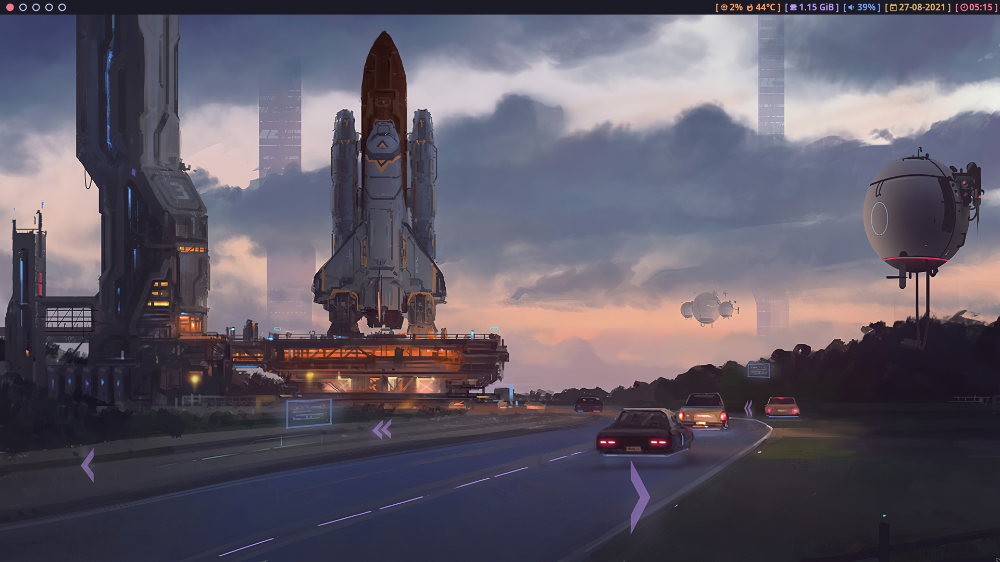
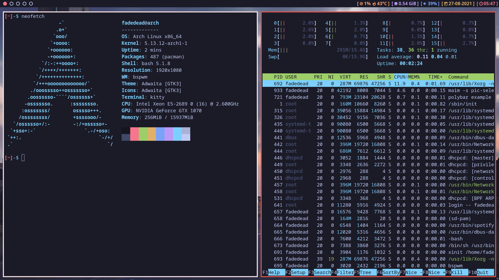
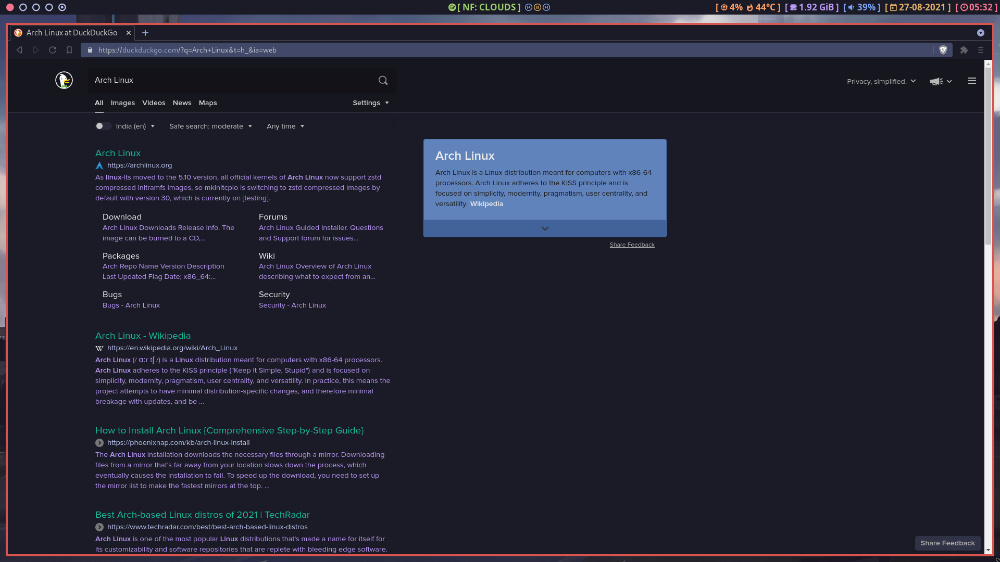
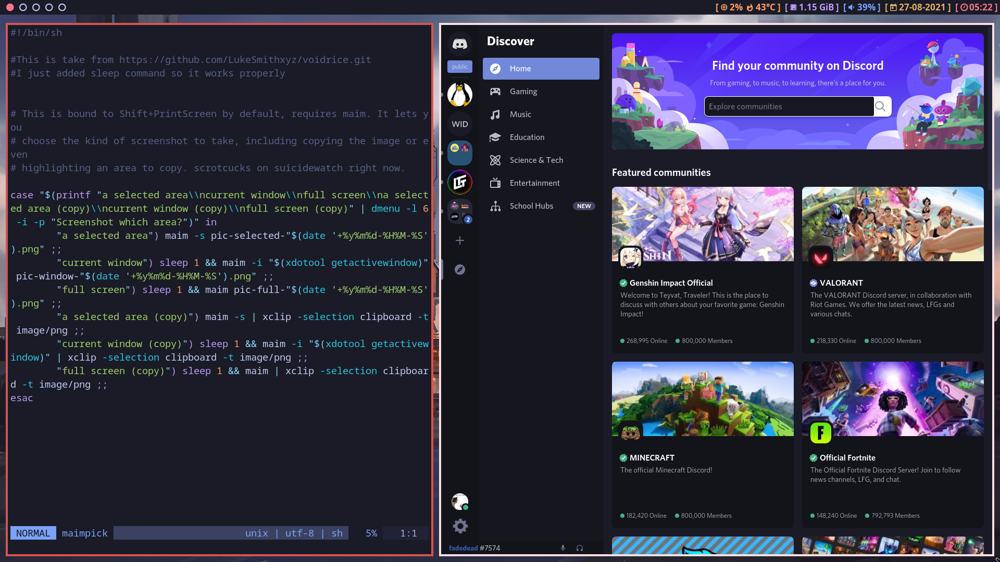

# Martian Night
These are my Arch Linux dotfiles inspired by the Tokyo Night color scheme in VSCode.

| | |
|---|---|
|  |  |
|   |  |

### Required Packages

| Name   | Description |
|---|---|
| [bspwm](https://archlinux.org/packages/community/x86_64/bspwm) | Window Manager  |
| [sxhkd](https://aur.archlinux.org/packages/sxhkd-git) | Hotkey daemon  |
| [polybar](https://aur.archlinux.org/packages/polybar) | Status bar |
| [dmenu](https://tools.suckless.org/dmenu/) | Suckless dynamic menu |
| [kitty](https://archlinux.org/packages/community/x86_64/kitty) | Terminal |
| [neovim](https://archlinux.org/packages/community/x86_64/neovim) | Terminal text editor |
| [fonts](https://aur.archlinux.org/packages/nerd-fonts-git) | Nerd, Awesome and Hack fonts |

### Additional Packages

| Name  | Description |
|---|---|
| [brave](https://aur.archlinux.org/packages/brave-bin) | Browser |
| [lf](https://aur.archlinux.org/packages/lf) | Terminal Filemanager |
| [maim](https://aur.archlinux.org/packages/maim-git) | Screenshot tool |
| [Xwallpaper](https://aur.archlinux.org/packages/xwallpaper-git) | Used by setbg to set wallpaper |
| [discord](https://archlinux.org/packages/community/x86_64/discord) | All-in-one voice and text chat |
| [better discord](https://betterdiscord.app) | Themeing discord |
| [spotify](https://aur.archlinux.org/packages/spotify) | Music streaming |
| [polybar spotify moudule](https://github.com/mihirlad55/polybar-spotify-module) | Allows spotify media control through polybar |

### Scripts and config

- Tokyo Night color schemes for Neovim and kitty are taken from [here](https://github.com/enkia/tokyo-night-vscode-theme).

- Some of the scripts in the bin folder are from [larbs](https://github.com/LukeSmithxyz/LARBS).
